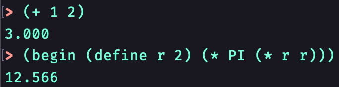
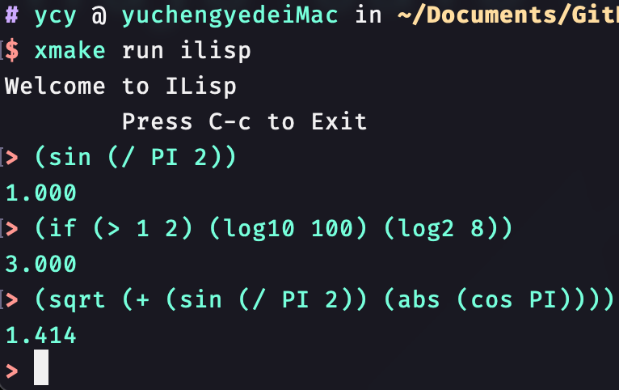
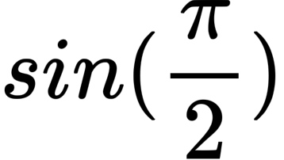
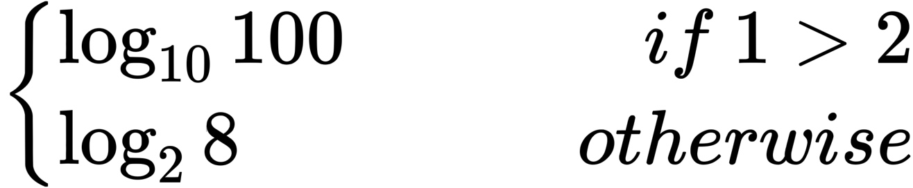
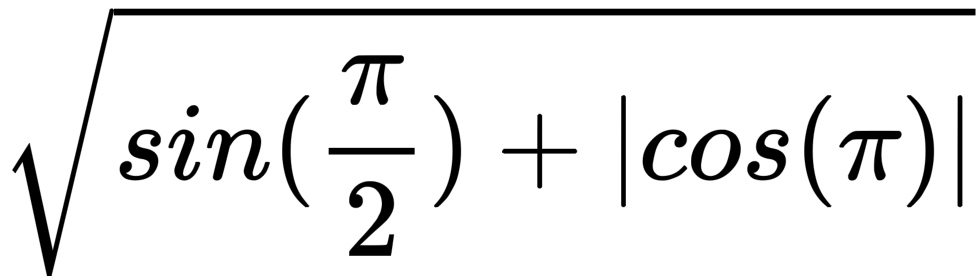

# ILisp
ILisp is a toy Lisp REPL with C++ Runtime.

ILisp can act as a simple calculator, equipped with "if" "define" "begin" keyword.

## Requirements
[google/re2](https://github.com/google/re2) for matching numbers and floats.

[CMake](https://cmake.org/) or [XMake](xmake.io) for building the project.

### Linux/macOS specific
[ediline](https://github.com/troglobit/editline) for cli interaction.

## Build
### CMake
```shell
git clone https://github.com/kabu1204/ILisp.git
cd ILisp
cmake . -B $path_to_build -DCMAKE_BUILD_TYPE=$mode    # mode = Release|Debug|RelWithDebInfo
cmake --build $path_to_build --target ILisp
$path_to_build/ILisp
```

### XMake
```shell
git clone https://github.com/kabu1204/ILisp.git
cd ILisp
xmake f -m $mode   # mode = release|debug|releasedbg
xmake
xmake run ilisp
```

## Examples








## REF
[SICP](https://mitpress.mit.edu/sites/default/files/sicp/full-text/book/book.html)

[Lispy](http://norvig.com/lispy.html)